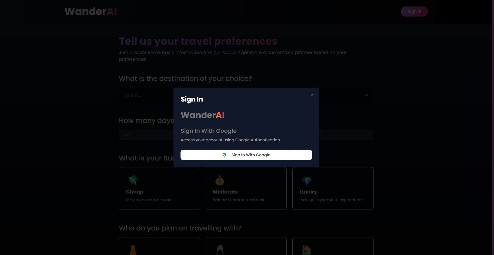
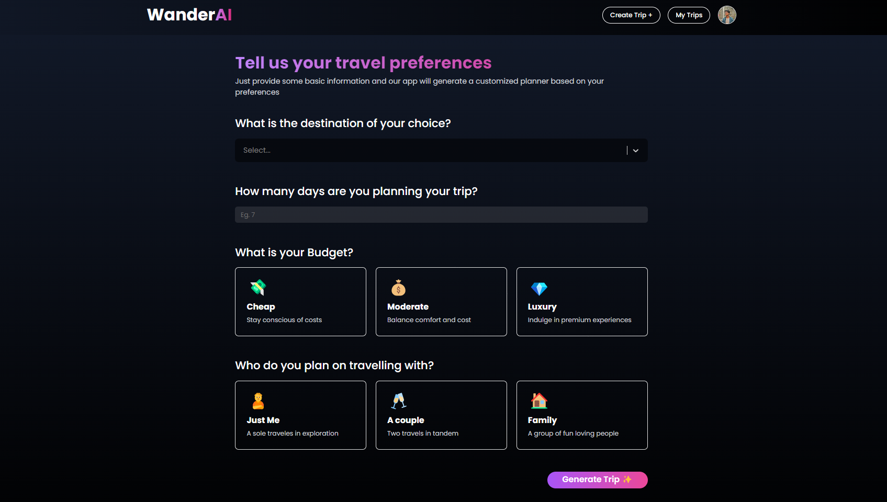
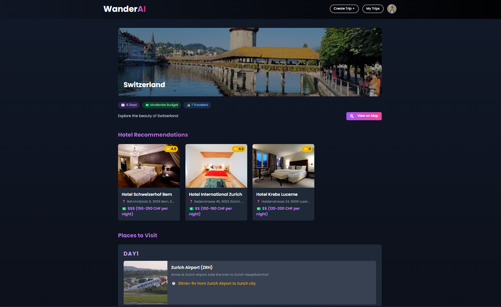
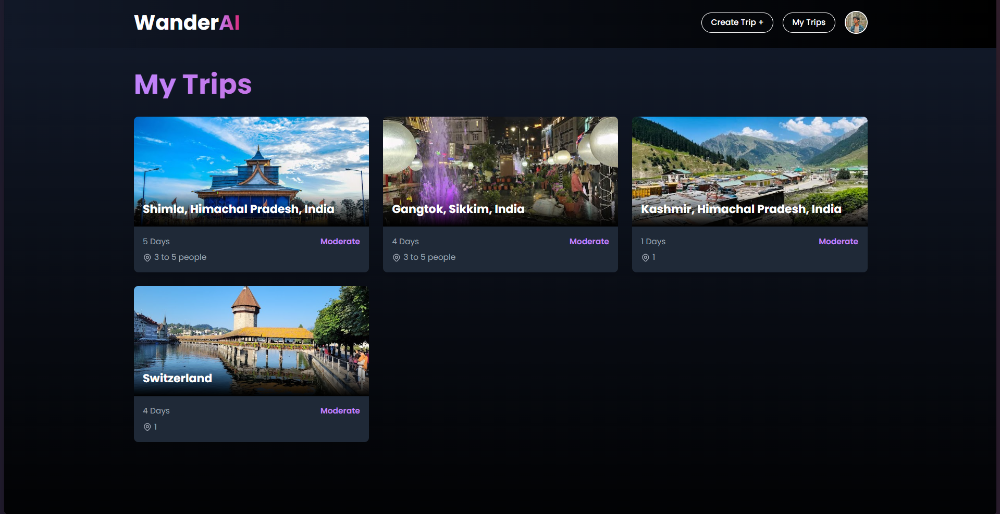

# WanderAI

WanderAI is a smart travel planning application that leverages AI to help users create personalized trips effortlessly. With features such as destination suggestions, itinerary planning, and trip management, WanderAI is the ultimate tool for explorers.

## Live link- https://wander-ai-v1.vercel.app/

## Features

- **AI-Powered Trip Planning**: Get smart suggestions for destinations, hotels, and places to visit.
- **Customizable Itineraries**: Plan your trips step by step with intuitive tools.
- **Trip Management**: View and manage your planned trips easily.
- **Protected Routes**: Ensure secure access with user-based route protection.
- **Responsive UI**: A seamless experience on any device, thanks to ShadCN UI.

## Tech Stack

- **Frontend**: ReactJS
- **UI Library**: Tailwind CSS, ShadCN
- **Animation**: Framer Motion
- **Authentication**: Google OAuth
- **APIs**: Gemini AI, Google Maps API
- **Utilities**: Firebase for backend services
- **Deployment**: Vercel

